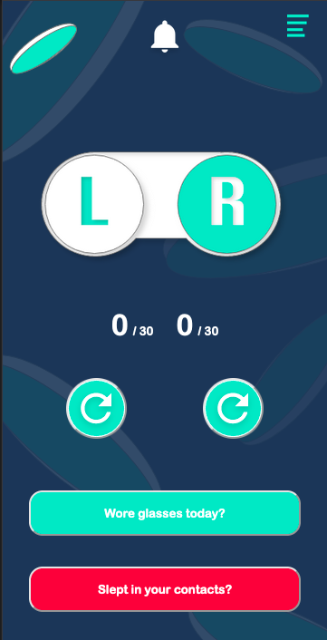

# Contact Solution

ContactSolution is an app that I wanted to build to help keep track how long your current contact lenses are in use, as well as your contact case. 

## Table of Contents

- [Overview](#overview)
    - [The Challenge](#the-challenge)
    - [Screenshot](#screenshot)
    - [Links](#links)
- [My process](#my-process)
  - [Built with](#built-with)
  - [What I learned](#what-i-learned)
  - [Continued development](#continued-development)
  - [Useful resources](#useful-resources)
- [Author](#author)

## Overview

### The Challenge

Currently, the application is still in development, but you will be able to:

- Separately track the days of each contact lens use. Sometimes I have to toss one contact, and keeping track of two different lenses was pitiful. 

- An alert will be sent when your contacts have been worn 30 days, and should be replaced.

- Track the number of days your current contact case has been in use.

- An alert will be sent when your contact case has been in use for 90 days and should be replaced.

- When starting with new lenses or a case, you can reset the counters for your left, and right contact. As well as for the contact case. 

- In addition to resetting the counter, you can subtract a day from the counter when you wear glasses, or add a day when you accidentally sleep in them :( .

- Soon, I would like to be able to begin tracking data, so each user can access the number of days contacts wore worn, glasses worn, etc. 

### Screenshot

### Links

- Solution URL: [Github Repo](https://github.com/JohnMichaelD/contact-Solution)
- Live Site URL: [Live Site](https://johnmichaeld.github.io/contact-Solution/)

## My Process

### Built With

- Designed in Adobe XD
- CSS custom properties
- Semantic HTML5 markup
- JavaScript
- Mobile-first Design principals

### What I Learned

### Continued Development

This project 

### Useful resources

- (Counter)[https://dev.to/stewyearth/making-a-simple-counter-in-javascript-html-2ici]

- (defer)[https://stackoverflow.com/questions/20495960/document-queryselector-is-null-error]
- (defer) [https://developer.mozilla.org/en-US/docs/Web/HTML/Element/script#attr-defer]

- (Time)[https://www.w3schools.com/js/tryit.asp?filename=tryjs_timing_clock]

## Author

- Website - [JMD](https://www.johnmdarrin.com)
- Frontend Mentor - [@JohnMichaelD](https://www.frontendmentor.io/profile/JohnMichaelD)